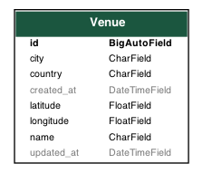

# MeetingPackage Full-Stack Challange

## Project Description

As stated in the challange description, I chose most comfortable language to create RESTful API endpoint ro return
venues inside given boundaries

* Application uses `Django 4` with a `Django REST framework`

### Database

Inside this task I am using SQLite database just for you to test quicker and do not spend time on setting up different
databases etc.

**I would use PostgresSQL database together with django application as it has good scalability and well maintained**

### Database Venue Model
Picture below shows how Venue object will be stored inside the database

## Installation

* Create and activate Virtualenv for python 3.9
* Install dependencies `pip install requirements.txt`
* Do migrations (database is SQLite do not need to do anything) `python manage.py migrate`
* Run the project `python manage.py runserver`

## Usage

Some dummy venues (the ones which are given inside the task description) has been populated during migrations.

* To access admin panel go to `/admin/` and login with credentials username: `mpackage` password: `demo123`
* To create, edit or delete `Venue` go to the `/admin/venues/venue/`
* To see endpoint response go to `/api/venues/get-nearby-venues/?lat=60.1814921&lon=24.8840972&radius=10`
* To run test cases run the command `python manage.py test` inside the console

## Notes

* The task took me up to 2 hours to complete maximum
* Wrote some simple test cases for the endpoint
* Wrote just a simple endpoint, I can explain how it can be scaled etc.
* The equation for the circle boundaries has been found online [here](https://stackoverflow.com/a/41298946/5293637)
* Application is fully scalable
* **Regarding performance, I did not add it now, but would add pagination for the venues response so if we have
  thousands it will not return everything at once**

I know you might be not familiar with Django, I am happy to discuss entire application during the call if needed 
